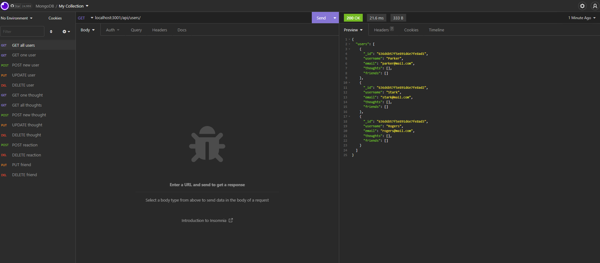
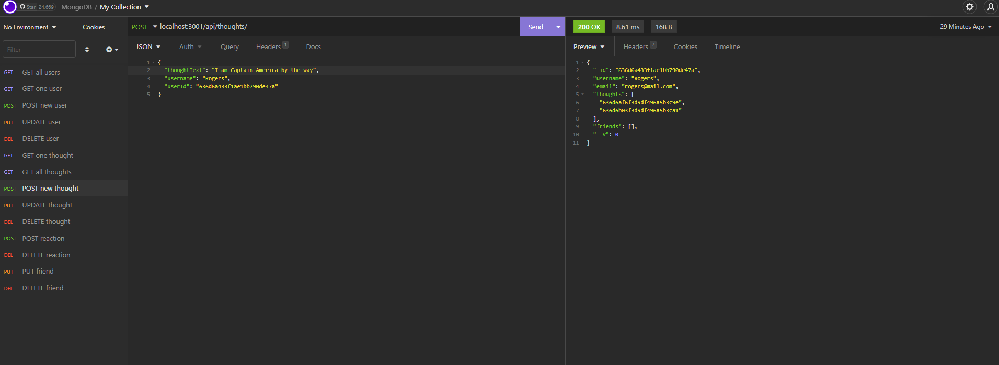

# Social Network API

## Description

Social networks are very popular. As a junior developer I found it interesting to look behind the curtains and see what goes on in the background. I built this simple API to get a better understanding of the mainstream databases outside of SQL. I have learned how to set up the database connection and how to create schemas and create relations between themThis backend API can serve as a skeleton for a simple networking application and further development. 

## Installation

First install the necessary libraries with the `npm install` command. Then create the database with some seed data by running the `npm run seed` command. 
To start the application use the `npm run start`. 

## Usage

Insomnia is recommended for the use of this API. Users can be created, updated, and deleted. Other users can be added or deleted as friends. Once a user is deleted its associated thoughts are also deleted with it. Users can post thoughts or comments of their own. Users can also update or delete their own thoughts. users can also react to posted thoughts or delete their own reactions. 

[Google drive video link](https://drive.google.com/file/d/1bczVo22fS0LEKta2TmPQVOn9eg2PM4xA/view?usp=sharing)

## Questions
  [My GitHub Profile](https://github.com/attila)

